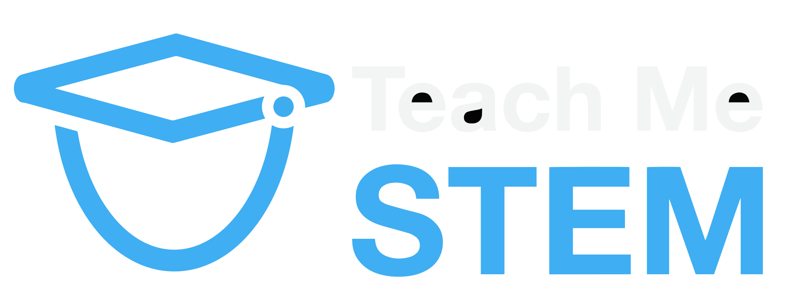

# TeachMeSTEM

Django web app for an education platform that provides resources, materials, and tools to help students prepare for their exams.

Some features include:

- 🔑 User registration and authentication via email or social account (e.g. Google)
- 📝 Upload and view revision notes, questions, model answers, and past papers
- 📐 Beautiful MathJax notes complete with worked example sections
- 📈 Track and evaluate progress by marking topics and past papers as complete
- 📍 Pick out subjects currently studying for quick access to revision material and overall progress
- 💌 Responsive HTML emails for account management (e.g. verification and forgotten password)
- 🚢 Easy-to-navigate and intuitive UI
